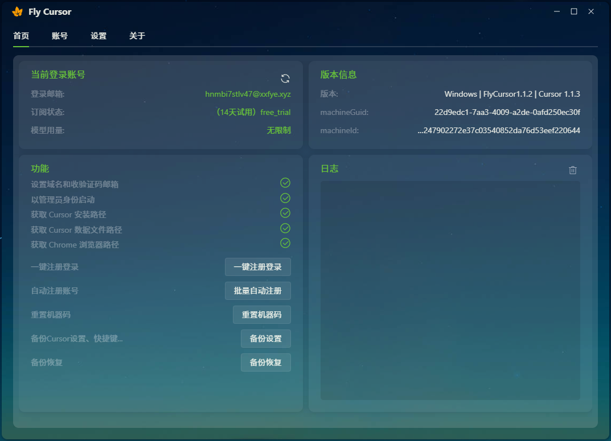

#### FlyCursor 是一款Cursor的免费账号辅助工具。
#### 用于无限续杯Cursor试用Pro，维持15天试用不掉，无限次数高级模型。

> - 支持最新版 `Cursor 1.1.3`
> - 暂时只支持 `Windows` 操作系统

### 核心功能

*   **一键切换账号**：轻松实现账号切换，重置并稳定维持 Cursor Pro 的试用状态。

*   **批量自动注册**：内置自动化脚本，批量注册新账号。

*   **账户管理**：支持导入导出、管理多个 Cursor 账号。

*   **备份**：轻松备份Cursor数据。

## 软件截图

 

---

## 自动注册-配置说明

#### 1.接收Cursor验证码的临时邮箱

程序需要一个临时邮箱来接收 Cursor 发送的验证码。您可以前往 [tempmail.plus](https://tempmail.plus) 获取免费的临时邮箱和对应的PIN码。

#### 2.个人域名

需要一个域名，用于生成注册用的无限邮箱地址（例如 `random_string@yourdomain.com`）。
建议自己购买域名，[阿里云低价域名3元左右/年](https://wanwang.aliyun.com/domain?spm=5176.30275541.J_ZGek9Blx07Hclc3Ddt9dg.2.6d242f3dOjUe0y&scm=20140722.S_card@@%E4%BA%A7%E5%93%81@@3417315._.ID_card@@%E4%BA%A7%E5%93%81@@3417315-RL_%E5%9F%9F%E5%90%8D-LOC_2024SPSearchCard-OR_ser-PAR1_213e367317506646568403729e0b4e-V_4-RE_new5-P0_0-P1_0)

##### 无限邮箱配置教程：[Bilibili - Cloudflare 邮箱转发服务配置教程](https://www.bilibili.com/opus/951275934028136469)

## 💰 赞赏

如果觉得这个项目对你有帮助，可以请我喝杯咖啡，鼓励作者持续更新。

  <table>
    <tr>
      <td>
         
      </td>
      <td>
         
      </td>
      <td>
         
      </td>
    </tr>
  </table>

---

## 授权协议

本项目采用 [CC BY-NC-ND 4.0](https://creativecommons.org/licenses/by-nc-nd/4.0/) 协议进行许可。

---
## 📩 免责声明

本工具仅供学习和研究使用，使用本工具所产生的任何后果由使用者自行承担。  

---

